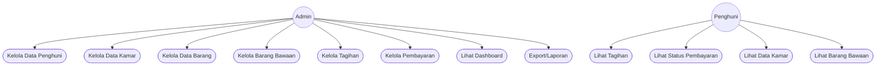

# Kost Management System (Static Simulation)

Aplikasi web simulasi manajemen kost/boarding house dengan UI modern, fitur lengkap, dan data statis (tanpa backend/database). Dirancang untuk demo, presentasi, dan perancangan sistem.

## Fitur Utama

### 1. Dashboard
- Ringkasan data penghuni, kamar, barang, tagihan, pembayaran.
- Info kamar kosong, hampir jatuh tempo, telat bayar.
- Navigasi cepat ke fitur utama.

### 2. Data Penghuni
- Tabel penghuni lengkap (ID, Nama, KTP, HP, Tgl Masuk, Status, dll).
- Tambah, edit, hapus, detail penghuni (simulasi modal).
- Statistik penghuni aktif, menunggu konfirmasi, kamar terisi.
- Pencarian penghuni.

### 3. Data Kamar
- Daftar kamar dengan status (Tersedia, Terisi, Maintenance), tipe (Standar, VIP, Deluxe), harga, fasilitas.
- Filter berdasarkan status, tipe, harga.
- Tambah, edit, hapus kamar (simulasi modal).
- Export data, print laporan.

### 4. Data Barang
- Tabel inventori barang (furniture, elektronik, dapur, kebersihan).
- Filter kategori, kondisi, dan pencarian.
- Tambah, edit, hapus barang (simulasi modal).
- Export data, laporan inventori, update stok.

### 5. Barang Bawaan
- Daftar barang bawaan penghuni (nama barang, jumlah, status check-in/out).
- Filter status, verifikasi, pencarian.
- Input barang bawaan, laporan check-in/out, export data (semua via modal statis).

### 6. Tagihan
- Daftar tagihan penghuni (status: menunggu, telat, lunas, dll).
- Filter status tagihan.
- Buat tagihan baru, kirim reminder, laporan tagihan, export data (semua via modal statis).

### 7. Pembayaran
- Daftar pembayaran (status: terverifikasi, menunggu, gagal, telat, dibatalkan).
- Filter status, metode, periode.
- Input pembayaran manual, laporan keuangan, export data, buat kwitansi (semua via modal statis).

## Navigasi & UI
- Semua fitur diakses dari sidebar dan dashboard.
- Semua aksi utama (tambah, edit, export, laporan) menggunakan modal statis yang responsif.
- Data dummy pada setiap modul mewakili semua status/tipe yang mungkin.
- Tidak ada backend/database, semua data hanya simulasi di frontend.

## Diagram Use Case

## Diagram Entity Relationship (ERD)

---

> **Catatan:**
> Semua data, aksi, dan filter hanya simulasi statis di frontend. Tidak ada database atau backend. Untuk pengembangan lebih lanjut, backend/API dapat diintegrasikan sesuai struktur data di atas.
